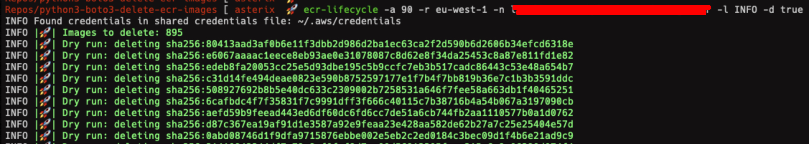

# ECR lifecycle (Alpha)

Delete old images inside ECR repository using python and boto3


[](https://github.com/nanih98/python3-boto3-delete-ecr-images/actions/workflows/publish-to-test-pypi.yml)


<!-- START doctoc generated TOC please keep comment here to allow auto update -->
<!-- DON'T EDIT THIS SECTION, INSTEAD RE-RUN doctoc TO UPDATE -->
**Table of Contents**  *generated with [DocToc](https://github.com/thlorenz/doctoc)*

- [ECR lifecycle (Alpha)](#ecr-lifecycle-alpha)
- [Requirements](#requirements)
- [Credentials](#credentials)
- [Installation](#installation)
- [Usage](#usage)
  - [Parameters](#parameters)
- [Example](#example)
- [TO DO](#to-do)
- [License](#license)

<!-- END doctoc generated TOC please keep comment here to allow auto update -->
# Requirements

* python3
* pip3

# Credentials

Credentials will be taken from your AWS_PROFILE in your terminal when you execute this python script.

```bash
$ aws configure
$ export AWS_PROFILE="myprofile" # will be set in the terminal where you'll execute the python script
```

# Installation

This tool is available in pypip package, so you can install it using your command line:

```bash
$ pip3 install ecr-lifecycle
```

# Usage

```sh
$ ecr-lifecycle -a 90 -r eu-west-1 -n repository/test/repo_name -l INFO -d true
```

## Parameters

* **-a:** max age of the image(default: 30 days)
* **-r:** aws region
* **-n:** ECR repository name
* **-l:** level info (default INFO)
* **-d:** dry run, only prints what happens, not execute (default: true)

# Example



# TO DO

You can store about 10mil images in a single ECR repository. Imagine, you have 2000mil images older than 90 days and you want to delete it. When you execute the programm, the client of boto3 only returns a max of 1000 values, so you need to launch the program twice. 

```python
client = boto3.client('ecr', region_name=args.aws_region)
images = client.describe_images(
    repositoryName=args.repository_name,
    maxResults=1000, # here, limit of max results 1000
)
```


# License

[LICENSE](./LICENSE)